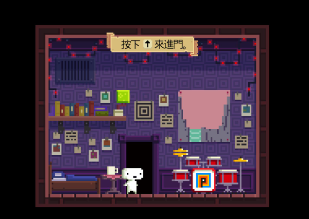
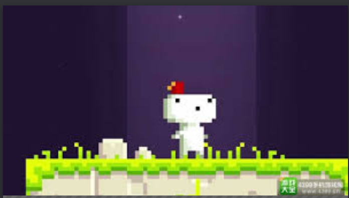
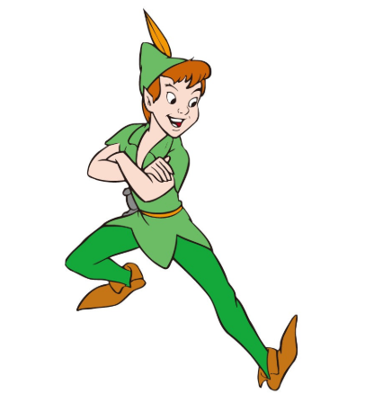
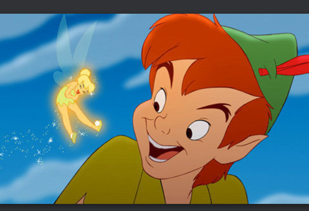

###人物设计参考：
####1. 主人公
人物设计背景：
主人公名字叫做李耳，是一名普通的高三学生，成绩不好不坏，离目标中的高等学府仍然差着些许分数，使他在学习上辛勤不辍，但是随着最终考核的临近他的精神压力也随之增大。
终于在某一日深夜，电闪雷鸣，伏案疾笔的他在移到电光闪过之后失去了意识。那似乎是灵魂出窍的契机，随着他的灵魂离开了躯体，他的意识变得越发沉重。
当再次醒来时，他来到了魔幻的世界，但是记忆似乎变得暧昧不堪，甚是模糊。
在 NPC 的引导下，他只好在这魔幻的世界不断向前，闯过层层阻碍，找回自我。

人物设计要素：
木偶的服装要素风格，服装参考西方中世纪的古典儿童风格，配色可以按照黑白红三色参考。

人物身体比例设计建议参考《菲斯帽》中的人物设计。

####2.NPC 风之精灵：
背景设定：无名的小精灵，从主人公醒来出现，似乎拥有长生的能力，经历了许多的岁月，是主人公前行路上的好帮手。
因为活的时间过于长，他似乎对于新奇的事物有着莫名的渴望同时对知识也有着近乎变态的追求。追随主人公冒险似乎是他一时兴起为生活找一点乐子。

人物设计要素：
服装设计：参考古老的迪斯尼小飞侠的设定以风元素的绿色为主。

身体设计要素：
人物设计比例的要小一些，长着一对可爱的翅膀。在实际制作过程中建议是等比缩放，__这要求其他人物的设计像素分辨率实际都是要高一些，这样有助于生动的展示像素的动态内容__。

人物动作设计需求（参考）：
1.主人公：
横向走动移动（左右可以相同）：
左膝盖弯曲抬起，向前呈 30 度左右角度，落地时与地面成 120 角度，按照正常的（笛卡尔）坐标轴角度来思考 ，双臂随着双腿的移动前后交替。

跳跃动作：
人物身体先做出半蹲动作，双臂向后与身体夹角呈现 30 度左右，向斜上方摆动，最后在空中保持双臂向上，双腿微微弯曲的效果。

落地动作：
人物落地膝盖弯曲进行缓冲，双臂惯性向前与身体呈现 60 夹角。

待命动作：
人物原地身体整体有规律的动做。体现一种呼吸的节奏，可以是身体整体的抖动产生一种呼吸的效果。
附加一个眨眼的效果，具体根据序列帧的设计加入

一个简单的抬手动作:
人物膝盖微屈，左手（右手）小臂抬起与身体呈现 90 度左右的的角度。身体轻微的抖动。

2. NPC 风精灵：
待机动作：
翅膀不断的煽动，身体周围有一点点像素点的特效。会随着节奏上下轻微的移动几个像素。