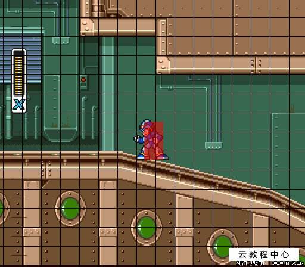

### 像素比例设计需求
设计参考：
screen size 设计为 1280 * 760 piexls

根据游戏玩法设计需求，人物检测判定将有人物所在网格判定，因此具体格子占比设定为 128 * 128 piexls 具体关卡内单元格数量以场景实际比例进行计算。

涉及需求调整及注意事项：
1. 游戏设计了单元格设定，因此在关卡设计中会有增设辅助网格以 graphics 系统实现对应单元格绘制，并且覆盖场景上层用于玩家辅助判断移动以及碰撞检测等游戏系统判定内容。
2. 关于人物设计内容，相关人物设计会按照对应尺寸比例进行缩放，至单元格对应合理大小，为了保证素材的尺寸以及内存消耗，需要按照对应尺寸以及原始尺寸出两套不同尺寸人物设计及动作用于开发以及后期优化。

3. 关卡素材设计中对应跳台以及地面的相应素材设计需要按照可拼接原则设计单元格，用于对应单元格生成相应的关卡内容。

