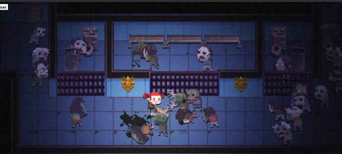
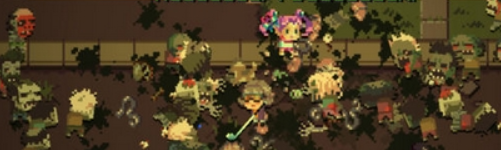
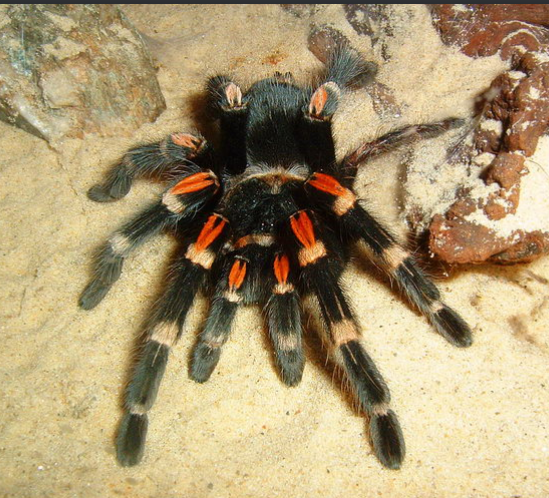

###敌人设计参考

1. 骷髅：
敌人背景设计：
收到魔幻世界魔法的影响，死去多年的白骨吸收了日月的精华变得可以自由活动，但是缺少人智，只是凭借本能渴望得到人的精血而不断的游走在人世间。

设计需求：
服装要素设计：
不需要特别华丽的设计，可以添加一些破碎的异物当作点缀.

服装设计可以参考，但是身体比例需要按照主人公身体设计需求保持统一。

2. 蜘蛛怪物：
敌人背景设计：
土生土长的异世界魔物，具有巨大的身躯但是行动依旧迅速，拥有锋利的獠牙当作武器。饥饿驱使着它们不断寻找新的猎物。

设计需求：
无服装。
身体设计参考黑色或者紫色，参考品种：

没有找到相关的合适素材，因此口头阐述一下注意要点，要求是横版游戏，因此，蜘蛛的设计要求贴近骷髅和主人公的横版设计，注意移动时的触手的移动观感。