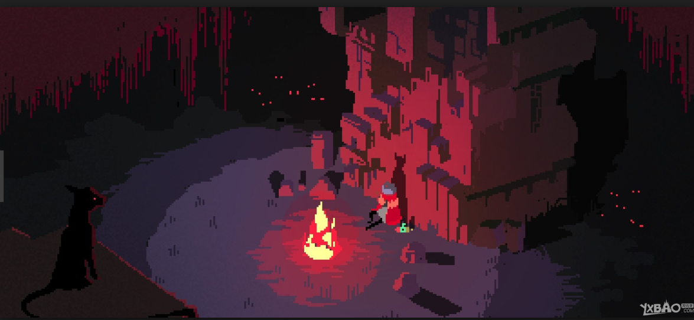
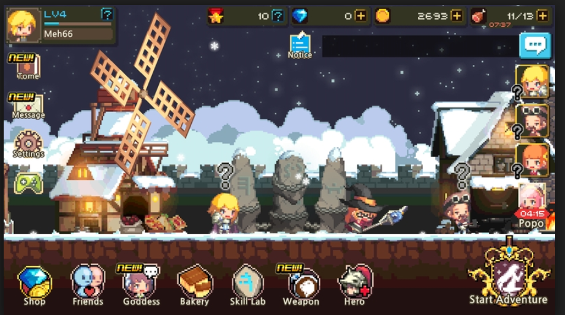
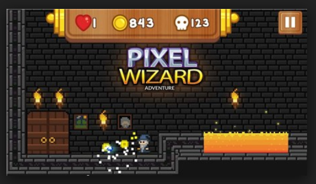
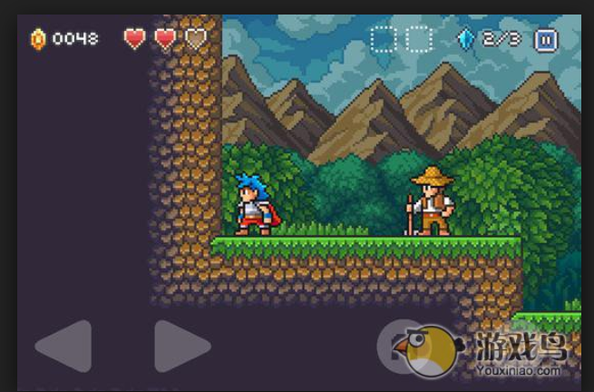
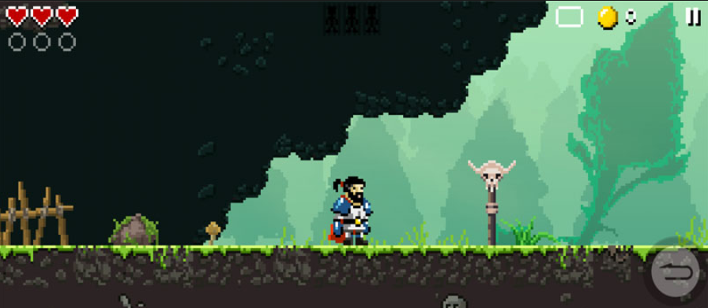

###美术风格需求：
游戏风格： 像素场景，像素人物，细致的动态效果
色调需求： 冷色调
设计元素：古堡，文具
目的： 贴近故事设计需求

####像素美术风格参考：

1. 主菜单背景设计需求，期望效果是一种超出标准界面设计的布局格式同时，做好是以俯视或者仰视的风格配合基本的色调以及风格需求设计界面。
详见 

2. UI 设计需求，以像素风格设计，具体不足特殊要求：
参考：

3. 关卡界面布局设计，可以参考市面上大部分的像素风格游戏，按照项目需求的色调加入文具，古堡，以及其他设计需求，整个场景的设计风格要有设计者个人较为突出的个性风格最好。
参考：

参考图示一

参考图示二

参考图示三